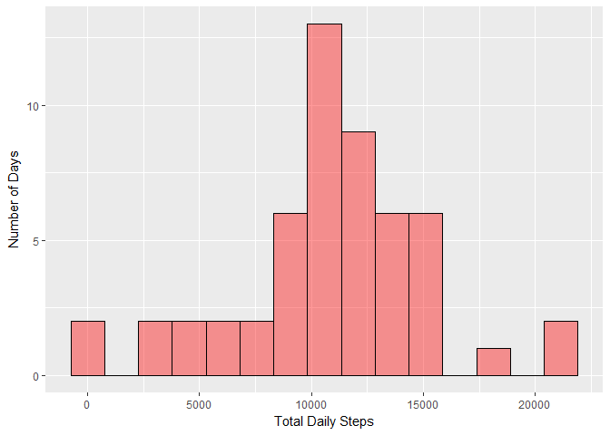
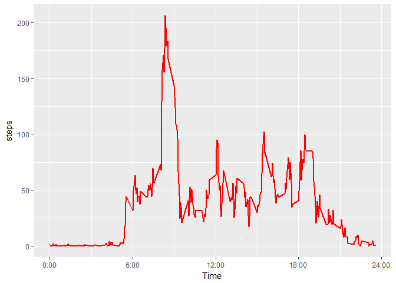
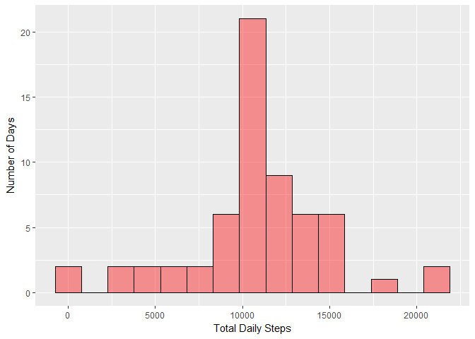
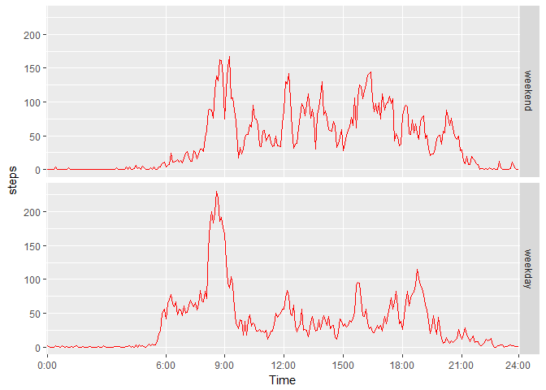

# Pedometer / Step Data
## Question 1 - Read and Process the data

```r
knitr::opts_chunk$set(echo = TRUE)
#load libraries
suppressWarnings(library(ggplot2))


#read data and save to data frame "activity"
activity <- read.csv("activity.csv")
```

## Question 2 - Histogram of total number of steps taken each day 

Calculate the total number of steps taken per day...


```r
steps_per_day <- aggregate(steps ~ date, activity, sum)
#plot the total number of steps per day in a histogram
ggplot(steps_per_day, aes(steps)) + geom_histogram(bins = 15, fill = "red", color = "black", alpha = .4) +
  ylab("Number of Days") + xlab("Total Daily Steps")
```

<!-- -->

## Question 3 - Mean & Median Number of Steps Take Each Day


```r
#calculate mean and median steps per day and round to nearest integer
mean_steps_day <- round(mean(steps_per_day$steps))
median_steps_day <- round(median(steps_per_day$steps))
#print results
paste("Mean Number of steps per day: ", mean_steps_day)
```

```
## [1] "Mean Number of steps per day:  10766"
```

```r
paste("Median Number of steps per day: ", median_steps_day)
```

```
## [1] "Median Number of steps per day:  10765"
```

## Questions 4 & 5 - Time series plot of 5 minute intervals


```r
# Make a time series plot (i.e. type = "l") of the 5-minute interval (x-axis) and the average number of steps taken, averaged across all days (y-axis)
# calculate mean number of steps per 5 minute interval
steps_per_int <- aggregate(steps ~ interval, activity, mean)
# convert interval to string characters that resemble times (method found on stack overflow from post by JAponte)
time_int <- substr(as.POSIXct(sprintf("%04.0f", steps_per_int$interval), format = '%H%M'), 12, 16)
# convert interval time strings to real time format and add to data frame
steps_per_int$time_int <- format(time_int, format = "%H:%M")
# add column w/date & time  - I can't get the plot to show x labels by the hour w/just time stamp
steps_per_int$datetime <- as.POSIXct(tz = "GMT", steps_per_int$time_int, format = "%H:%M" )


# Plot the time series, add breaks at each hour
timeplot1 <- ggplot(steps_per_int, aes(interval, steps)) + geom_line(color = "red", size = 1)
timeplot1 + scale_x_continuous(breaks = c(0, 600, 1200, 1800, 2400), labels = c("0:00", "6:00", "12:00", "18:00", "24:00")) + xlab("Time")
```

<!-- -->


```r
# Print the interval with the max steps
max_steps <- steps_per_int[which.max(steps_per_int$steps),]
max_steps
```

```
##     interval    steps time_int            datetime
## 104      835 206.1698    08:35 2017-12-22 08:35:00
```

## Question 6 - Strategy for imputing missing data

Replace missing step counts (N/A's) with the average step count for each given interval across all days. 


```r
#Create a second data frame called "activity2" by merging "activity" and "steps_by_int" data frames by matching intervals.  Then replace the missing values in steps.x with the mean values from steps.y.
activity2 <- merge(activity, steps_per_int, by = "interval")
activity2$steps.x[is.na(activity2$steps.x)] <- activity2$steps.y[is.na(activity2$steps.x)]
```
## Question 7 - Histogram of the total number of steps taken each day after missing values are imputed


```r
steps_per_day2 <- aggregate(steps.x ~ date, activity2, sum)
#plot the total number of steps per day in a histogram
ggplot(steps_per_day2, aes(steps.x)) + geom_histogram(bins = 15, fill = "red", color = "black", alpha = .4) +
  ylab("Number of Days") + xlab("Total Daily Steps")
```

<!-- -->
Number of days with the most common range of steps (approximately 10-ll thousand steps) increased from 13 days to 21 days.  This would suggestion a reduction in variance.


```r
#calculate mean and median steps per day and round to nearest integer
mean_steps_day2 <- round(mean(steps_per_day2$steps.x))
median_steps_day2 <- round(median(steps_per_day2$steps.x))
#print results
paste("Mean Number of steps per day: ", mean_steps_day2)
```

```
## [1] "Mean Number of steps per day:  10766"
```

```r
paste("Median Number of steps per day: ", median_steps_day2)
```

```
## [1] "Median Number of steps per day:  10766"
```
 Mean and Median of imputed data was approximately the same as that of the data with the missing values (mean was exactly the same and median was different by only 1 step)
 
## Question 8 - Compare patterns for weekdays against weekends
 

```r
# Add weekdays to dataframes "steps_per_day2" and "activity2""
steps_per_day2$weekdays <- weekdays(as.Date(steps_per_day2$date))
activity2$weekdays <- weekdays(as.Date(activity2$date))
# Add factor for weekday vs weekend
# Create variable to hold list of weekend days
weekends <- c("Saturday", "Sunday")
steps_per_day2$weekend <- factor((steps_per_day2$weekdays %in% weekends), levels = c(TRUE, FALSE), labels = c("weekend", "weekday"))
activity2$weekend <- factor((activity2$weekdays %in% weekends), levels = c(TRUE, FALSE), labels = c("weekend", "weekday"))
# found above method in stackoverflow from user akrun.

#Add column for datetime and convert to posixct
activity2$datetime <- paste(activity2$date, activity2$time_int)
activity2$datetime <- as.POSIXct(activity2$datetime, tz = "GMT")
# convert interval in activity2 to a factor
activity2$interval <- factor(activity2$interval)
# create new data frame steps_per_int_per_wknd by aggregating from activity2
wknd_steps <- aggregate(steps.x ~ interval + weekend, activity2, mean)
#rename column steps.x
names(wknd_steps) <- sub("^steps.x$", "steps", names(wknd_steps))

# Make panel plots for weekend and weekday intervals
wknd_plot <- ggplot(wknd_steps, aes(interval, steps)) + geom_line(group = 1, color = "red") + facet_grid(weekend ~.)
wknd_plot + 
scale_x_discrete(breaks = c(0, 600, 900, 1200, 1500, 1800, 2100, 2355), labels = c("0:00", "6:00", "9:00", "12:00", "1500", "18:00", "21:00", "24:00")) + 
xlab("Time")
```

<!-- -->
Time plot of weekends vs. weekdays shows a pattern of sleeping in and staying up late on the weekends compared to weekdays.  Weekend activity also shows more consistent activity throughout the day.  Looks like a pattern for somebody with a Monday-Fri office job :).
